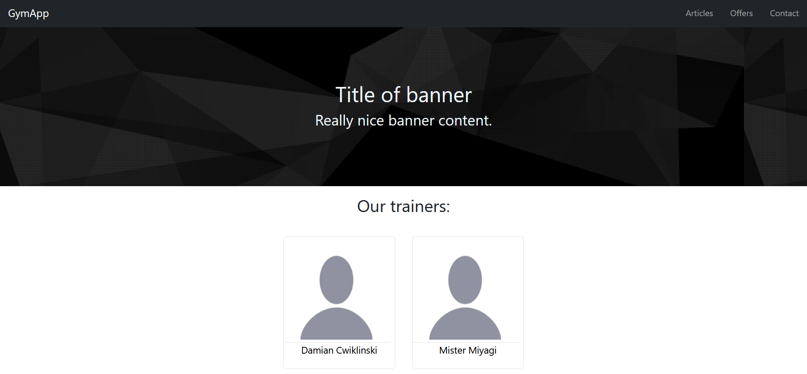
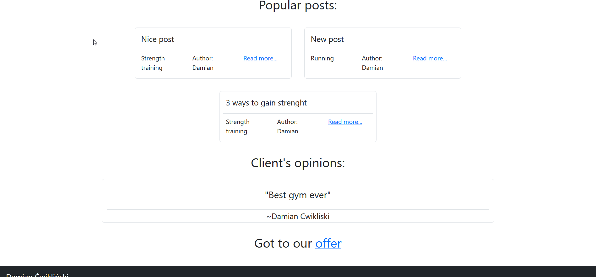
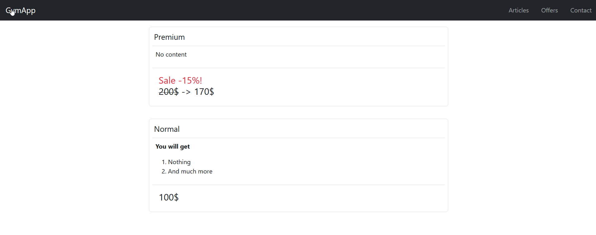
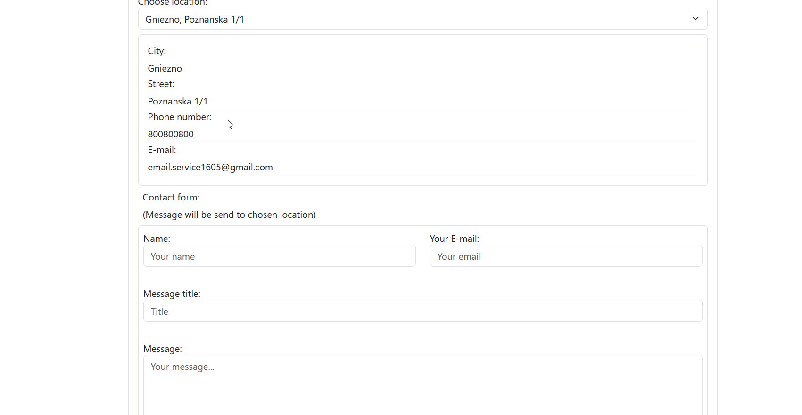
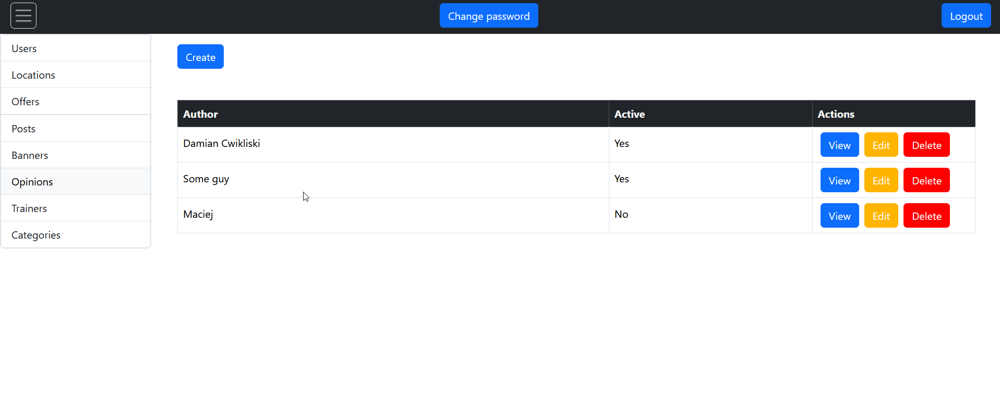
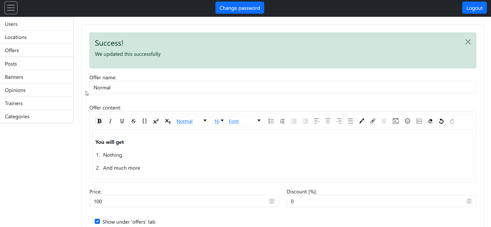

# Gym Website CMS
## About 
It's a content managment system for a gym website. It consists of main page and admin panel that allows to change and add new content to site (posts, trainers, banners, client's opinion).
Project made with Java, Spring Boot and PostgreSQL as backend and TypeScript and React as Frontend.
## Running the project
If you have docker everything should work after using `docker compose up` in the main folder of the project (here). By default backend is on port 8080, frontend on 3000.

After starting the app you can access main page on [localhost:3000](localhost:3000) and admin panel on [localhost:3000/login](localhost:3000/login)

Default administrator:  
login: root  
password: root

Default normal user:  
login: user  
password: user

To user email capabilities you have to edit username and password for gmail in [this file](Backend/gymcms/src/main/resources/application.yml) and build the project again.

## Implemented functionalities
- Main gym page with content (cycling through banners and opinions)

- Offers page

- Contact page with ability to send email to chosen location

- Article and Trainer pages
- Signing in to admin panel
- Password reset
- Password change
- Adding, editing and deleting users
- Lists of created content

- Editing, adding, deleting content
- Posts, trainers, opinions, banners can be disabled without deleting them

## To do
- Finish file uploading implementation
- Logs
- Pagination and sorting (mainly for posts)
- Improve look of main website
- Refactor of some parts of the code
